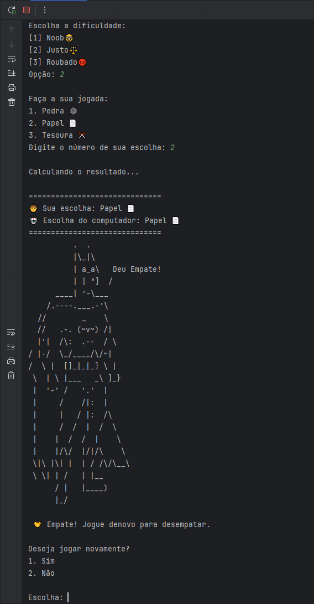

<h1 align="center">
  <h1 align="center">JokenPython</h1>
</h1>

<h4 align="center">
  Basicamente, um Jokenpô feito em Python, e utilizando ASCII Art
</h4>

  <a href="#Description">Descrição</a>&nbsp;&nbsp;&nbsp;|&nbsp;&nbsp;&nbsp;
  <a href="#Build with">Feito com</a>&nbsp;&nbsp;&nbsp;|&nbsp;&nbsp;&nbsp;
  <a href="#License">Licença</a>&nbsp;&nbsp;&nbsp;|&nbsp;&nbsp;&nbsp;
  <a href="#Contact">Contato</a>&nbsp;&nbsp;&nbsp;|&nbsp;&nbsp;&nbsp;

 

  

<h2 id="Description">:memo: Descrição do Projeto</h2>

O jogo é Player vs Máquina e tem 3 dificuldades:
- Noob (o player sempre ganha)
- Justo (Aleatório se alguém ganha ou se há empate)
- Roubado (a máquina sempre ganha)

Mostra na tela quais foram as jogadas e quem venceu, armazenar pontuação e perguntar se deseja continuar jogando.

<h2 id="Build with">:pencil2: Feito com</h2>

Este projeto foi construído com as tecnologias:

- Python

<h2 id="License">:scroll: License</h2>

Este projeto está sob a licença MIT. Sinta-se à vontade para contribuir, fazer fork e usar este projeto como base para seus próprios projetos!

<h2 id="Contact">:telephone_receiver: License</h2>

- Acesse também meus outros repositórios no [Github](https://github.com/matheusfdosan?tab=repositories).

- Também me siga no [Instagram](https://instagram.com/matheusfdosan).

- Crie conexão comigo no [Linkedin](https://linkedin.com/in/matheusfaus).
